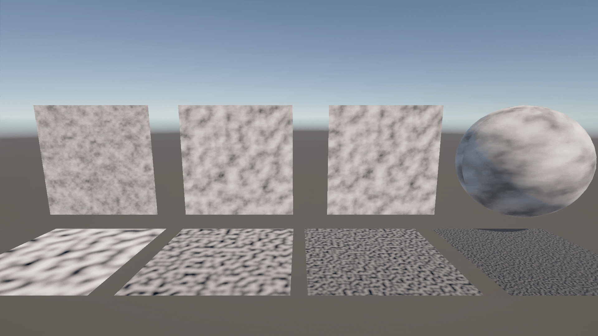
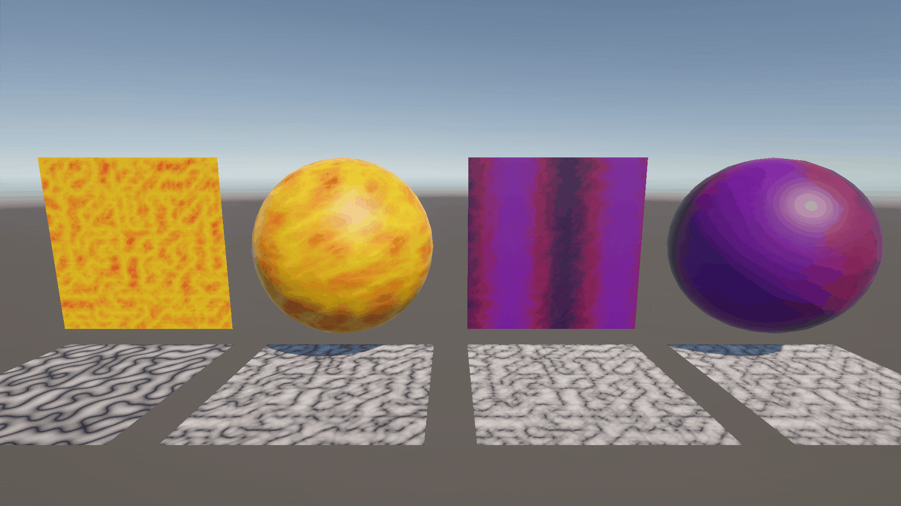
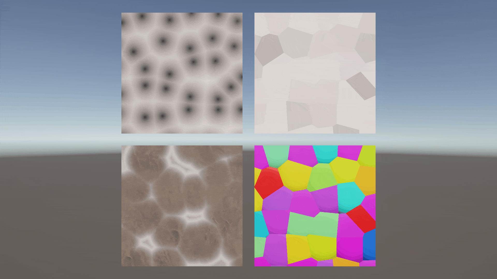

# ノイズ

## はじめに

プログラムワークショップⅣの管理用です

## 結果画像

### ノイズ

### FBM

### パターン

### ボロノイ図

### 炎

### ディゾルブ

### あなたの考えた素敵なシェーダー

-- 工夫した点：xxx

## 進め方

- 本リポジトリ (tpu-game-2025/PGWS4_9_noise)をforkしてください
- fork先のリポジトリを更新してください
- Unityのプロジェクトをsrc内で進めてください
- 結果を画面キャプチャして、画像としてリポジトリに追加して、上記のリンクから見られるようにしてください
- 完成したら本リポジトリのmainブランチにpull requestを投げてください
